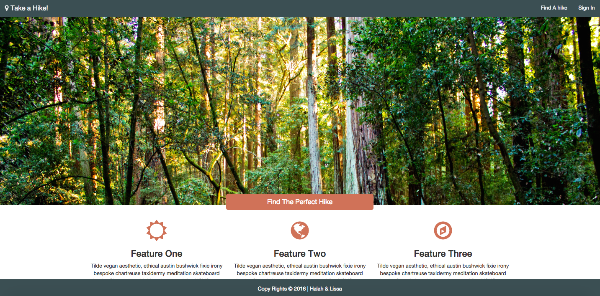

##Take A Hike

### Project Description

A CRUD app, made by [Lissa Walzer](https://github.com/walzerm) and [Halah Al Shaikhly](https://github.com/HalahRaadSalih) that gives users recommendations for local hikes in WA based on current weather conditions.

### Who uses it

Washington residents or visitors who like to hike and don't like getting wet!

### Outputs

List of possible hikes that uses can take, within a set location, and in "good" weather in WA.

### Input

- Location
- Desired radius, based on zip code
- Various desired hiking parameters
- Day (for weather)

### Technologies
- Javascript
- Node.js
- Express
- Nightmare.js to scrape information from [Washington Trails Association](http://www.wta.org/)
- Passport
- PostgreSQL
- OAuth
- CSS
- HTML
- Bootstrap
- knex
- [Weather API](http://openweathermap.org/api)
- [Zip code API](https://www.zipcodeapi.com/)

### Features

- Signup for a user account
- Create lists to save hikes
- Save/update/delete hikes from lists
- Enter location to get hike recommendations within a set radius
- Get linked to wta.org for detailed hike descriptions

### Wireframes
- [Intro Page](https://wireframe.cc/U77zgJ)
- [Search Page](https://wireframe.cc/qiD9Uj)
- [User page](https://wireframe.cc/SlbVEB)
- [Login page](https://wireframe.cc/KQQXIg)
- [Create account page](https://wireframe.cc/xX5mzG)

### Site Map
[SiteMap](https://docs.google.com/drawings/d/1Jq2oxTl2ohGSNpi5BduJFblOwwGwdVJ021cfo5fvvT4/edit?usp=sharing)
